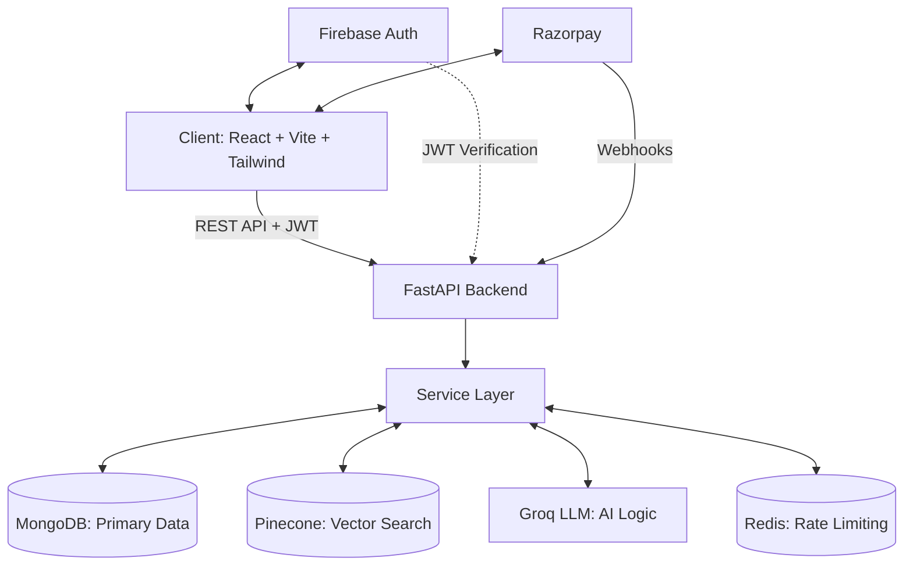

# 🎓 Counsellor Wala — The Future Mapped

**Counsellor Wala** is a production-grade, AI-powered college counselling SaaS platform built with **FastAPI** (Backend) and **React + Vite** (Frontend). It helps students navigate JEE Main and Advanced counselling with data-driven insights, interactive analytics, and a contextual AI counsellor — secured by enterprise-level authentication and payment architecture.

---

## ✨ Key Features

- **🚀 Smart Rank Predictor**: Uses 10 years of historical JoSAA/CSAB cutoff data to classify admission chances as **SAFE**, **TARGET**, or **DREAM**.
- **📄 Counsellor Sheet Generator**: Produces a customized, drag-and-drop priority-ordered college list based on rank, home state, gender, and preferred branches. Includes **one-click PDF Export** for premium users.
- **📊 Interactive Cutoff Analytics**: A dashboard for comparing branch-wise cutoff trends over 10 years with interactive Recharts visualizations.
- **🤖 AI Counsellor (RAG)**: A context-aware floating AI assistant powered by **Groq** and **Pinecone**, capable of answering complex admission queries using a vector database.
- **💳 Razorpay Payments**: Full Razorpay integration with server-to-server webhooks for guaranteed premium fulfillment — even if the user's network disconnects mid-payment.
- **🔐 Firebase JWT Authentication**: All sensitive endpoints are protected by cryptographic JWT verification via Firebase Admin SDK. Identity spoofing is impossible.
- **🏗️ Premium UI/UX**: Glassmorphic aesthetics, atmospheric glow effects, micro-animations, and mobile-responsive layouts.
- **📚 Rich College Profiles**: Enriched data for 130+ IITs/NITs/IIITs/GFTIs with Wikipedia-sourced summaries, fee structures, NIRF ranks, and dual college comparison.

---

## 🏗️ Technical Architecture



### Stack Detail
| Layer | Technologies |
|:------|:-------------|
| **Frontend** | React 18, Vite, TypeScript, Tailwind CSS, Framer Motion, Recharts, Shadcn/UI, jsPDF |
| **Backend** | FastAPI, MongoDB (Pymongo), Redis (optional), Pinecone (Vector Store) |
| **AI** | Groq (OpenAI-compatible API), Sentence Transformers (Embeddings) |
| **Auth** | Firebase Admin SDK (JWT verification), Firebase Client SDK (Email/Google/Phone) |
| **Payments** | Razorpay (Order creation, signature verification, server-to-server webhooks) |
| **Testing** | Pytest (backend), Vitest (frontend), Playwright (E2E) |

---

## 🔐 Security Architecture

- **JWT Authentication**: Every sensitive endpoint verifies the Firebase ID token via `firebase-admin`. The server extracts the `uid` from the cryptographic token — never from the request body.
- **Anti-Spoofing**: Users cannot impersonate others. The `get_current_user` dependency rejects any request without a valid Bearer token.
- **Payment Replay Protection**: Razorpay orders are bound to the authenticated user's database record. The verification endpoint enforces that the payment belongs to the requesting user.
- **Webhook Fulfillment**: A dedicated `/payments/webhooks/razorpay` endpoint receives server-to-server callbacks. Even if the frontend disconnects after payment, the backend independently activates the subscription.
- **Rate Limiting**: Per-IP rate limiting with Redis support for distributed deployments. Falls back to in-memory buckets for single-server setups.
- **Security Headers**: HSTS, X-Content-Type-Options, X-Frame-Options, and CSP headers on every response.

---

## 📁 Repository Structure

```
├── frontend/                  # React + Vite Frontend
│   ├── src/
│   │   ├── components/        # Reusable UI components, ErrorBoundary, ChatWidget
│   │   ├── contexts/          # Auth, Theme, Subscription, Compare, UserPreferences
│   │   ├── pages/             # Predictor, CounsellorSheet, Colleges, etc.
│   │   │   └── landing/       # Landing page sections (Hero, Features, Pricing)
│   │   ├── services/          # Axios API layer with JWT interceptor
│   │   └── App.tsx            # Main Router with ErrorBoundary
│   └── tests/e2e/             # Playwright E2E tests
├── app/                       # FastAPI Backend
│   ├── api/v1/                # API Endpoints (Payments, AI Chat, Counsellor, etc.)
│   ├── core/                  # Auth (JWT), Rate Limiter (Redis), Security Headers
│   ├── services/              # Business Logic (RAG, Prediction, Classification)
│   ├── db/                    # MongoDB connection manager
│   ├── middleware/             # Performance monitoring, Request ID tracking
│   ├── schemas/               # Pydantic request/response schemas
│   ├── tests/                 # Pytest backend test suite
│   ├── utils/                 # Logger, Cache (Redis), AI Client
│   └── main.py                # FastAPI app with lifespan manager
├── data_pipeline/             # JoSAA/CSAB web scrapers & data upload
├── requirements.txt           # Python dependencies
└── run.py                     # Uvicorn ASGI server runner
```

---

## 🔧 Setup & Installation

### Prerequisites
- Python 3.11+
- Node.js 18+
- MongoDB (local or Atlas)
- Redis (optional — app works without it)
- Firebase project with Auth enabled

### Backend

1. **Create a virtual environment and install dependencies**:
   ```bash
   python -m venv venv
   venv\Scripts\activate  # Windows
   # source venv/bin/activate  # Mac/Linux
   pip install -r requirements.txt
   ```

2. **Configure environment variables** — copy `.env.example` to `.env`:
   ```bash
   cp .env.example .env
   ```
   Required keys:
   ```env
   MONGO_URI=mongodb://localhost:27017
   GROQ_API_KEY=your-groq-api-key
   PINECONE_API_KEY=your-pinecone-api-key
   RAZORPAY_KEY_ID=your-razorpay-key
   RAZORPAY_KEY_SECRET=your-razorpay-secret
   ```

3. **Place Firebase Admin SDK credentials**:
   Download your Firebase service account JSON and place it in the project root. Update the path in `app/core/auth.py` if needed.

4. **Run the development server**:
   ```bash
   python run.py
   ```
   The API will be available at `http://localhost:8000`. Docs at `/docs`.

### Frontend

1. **Install and run**:
   ```bash
   cd frontend
   npm install
   npm run dev
   ```

2. **Configure Firebase & Razorpay**: Set these variables in `frontend/.env`:
   ```env
   VITE_FIREBASE_API_KEY=your-key
   VITE_FIREBASE_AUTH_DOMAIN=your-project.firebaseapp.com
   VITE_FIREBASE_PROJECT_ID=your-project
   VITE_RAZORPAY_KEY_ID=your-razorpay-key
   ```

3. The app will be available at `http://localhost:8080`.

---

## 🧪 Running Tests

### Backend (Pytest)
```bash
$env:PYTHONPATH="."   # PowerShell
pytest app/tests -v
```

### Frontend (Vitest)
```bash
cd frontend
npm run test
```

### E2E (Playwright)
```bash
cd frontend
npm run test:e2e
```

---

## 🛡️ Data Normalization

The platform employs optimized filtering logic for JoSAA quotas (AI, HS, OS). It automatically manages differences between JEE Main (NITs/IIITs) and JEE Advanced (IITs) eligibility logic, ensuring accurate results and preventing duplicates.

---

## 📄 License
MIT License
